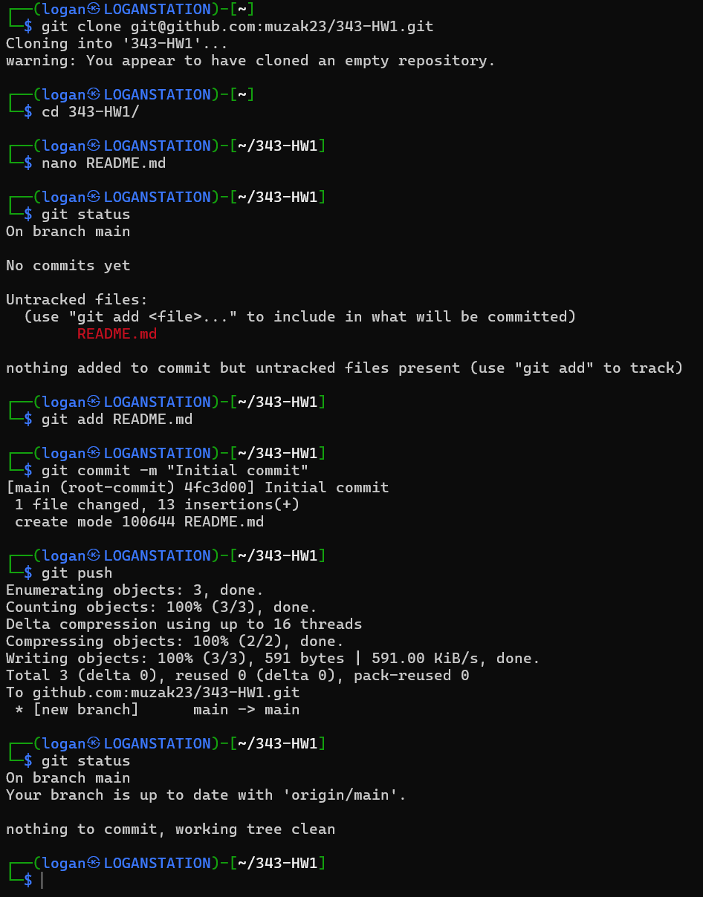

# Hello, I'm Logan Nommensen

Some of the `git` commands you'll have to use often include:

- `git clone <URL or SSH connection>` - Clones a repo into a folder on your local machine
- `git commit -m <commit message>` - Adds the current changes to a commit on your local repo, with the specified message
- `git push` - Pushes your local commits to the remote repo
- `git pull` - Pulls any changes in the remote repo to your local repo
- `git status` - Shows modified files, and warns if modified files are not added
- `git add <file>` - Adds the specified file to `git` tracking

Here is a screenshot of a few of these commands in action:

